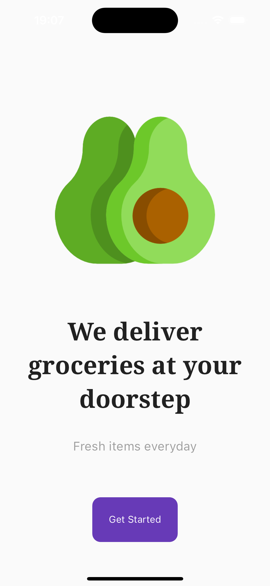
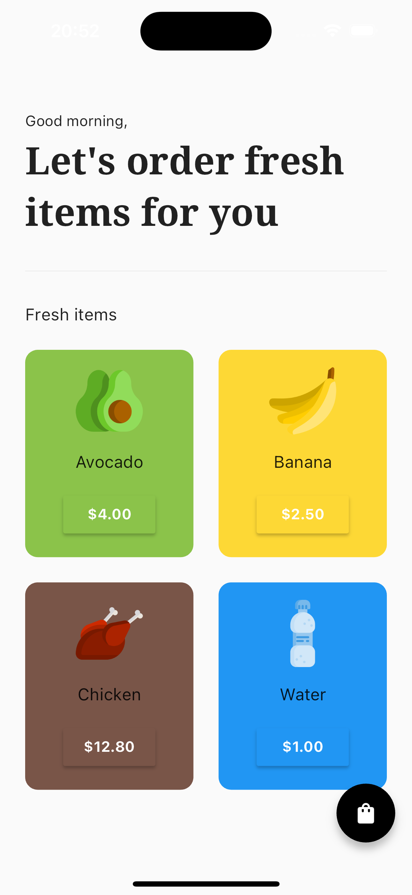
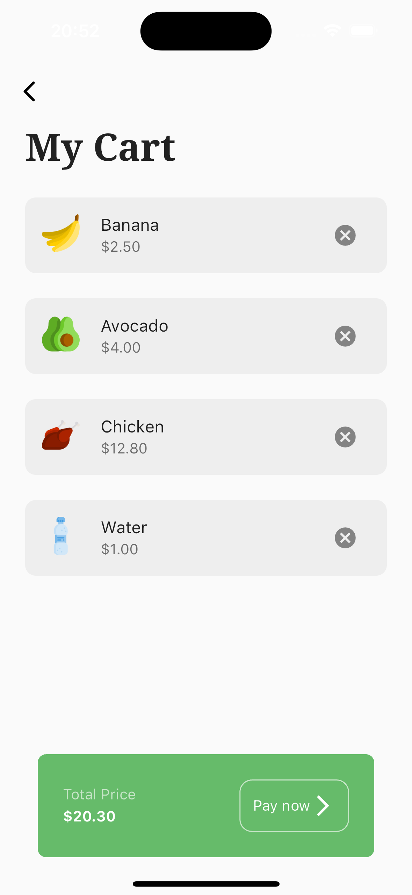
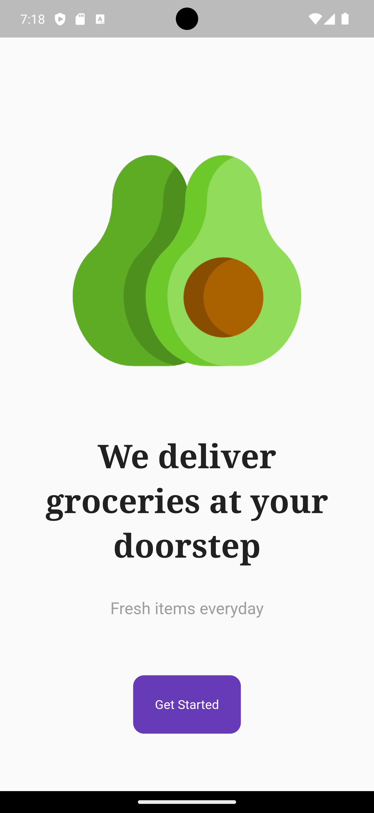
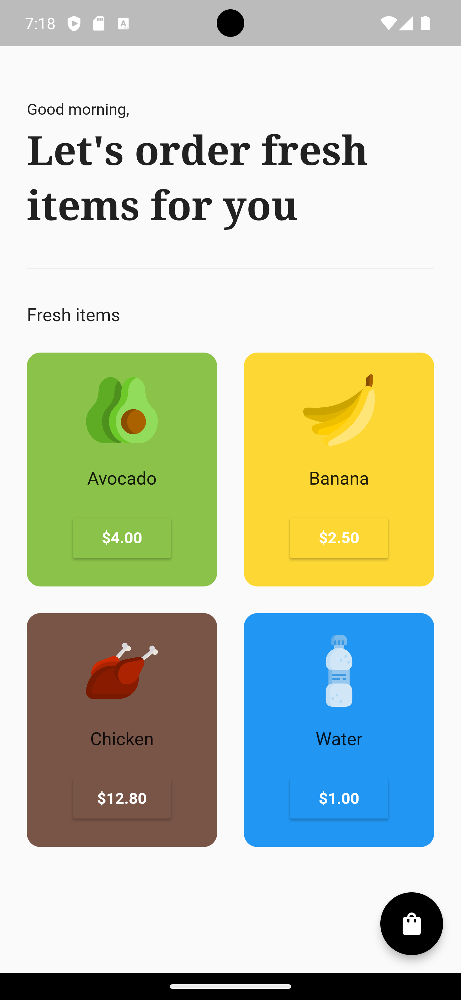
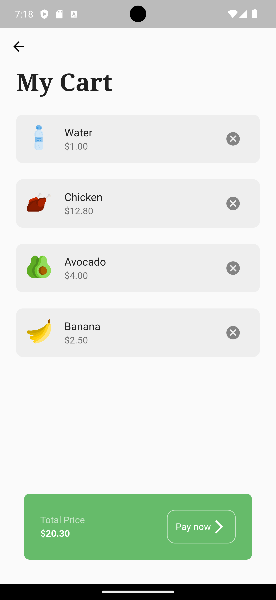

# Grocery Minimalist App Flutter 

## Stack:

- Dart
- Flutter
- Providers
- Google Fonts

### Version iOS:

 &nbsp; &nbsp; &nbsp;  &nbsp; &nbsp; &nbsp; 

### Version Android:

 &nbsp; &nbsp; &nbsp;  &nbsp; &nbsp; &nbsp; 
